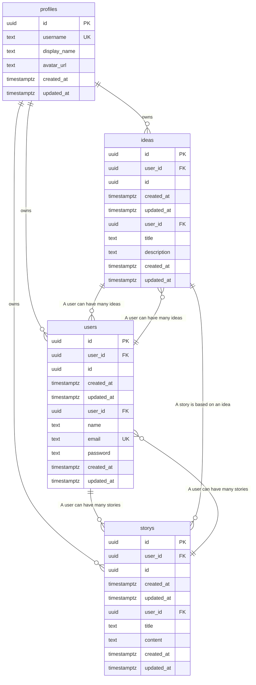

# Entity Relationship Diagram - MemoryMosaic Premium

> **Auto-generated** from your idea analysis
> **Entities:** 3

---

## Visual Diagram

---

## Entity Details

### Idea
> A user's idea for a story

**Fields:**
  - `id`: uuid (required) - Primary key
  - `created_at`: datetime (required) - Creation timestamp
  - `updated_at`: datetime (required) - Last update timestamp
  - `user_id`: uuid (required) - Owner user ID
  - `title`: string (required)
  - `description`: text

**Relationships:**
  - one_to_many → **User**: A user can have many ideas

### Story
> A user's story

**Fields:**
  - `id`: uuid (required) - Primary key
  - `created_at`: datetime (required) - Creation timestamp
  - `updated_at`: datetime (required) - Last update timestamp
  - `user_id`: uuid (required) - Owner user ID
  - `title`: string (required)
  - `content`: text (required)

**Relationships:**
  - many_to_one → **Idea**: A story is based on an idea
  - one_to_many → **User**: A user can have many stories

### User
> A user of the platform

**Fields:**
  - `id`: uuid (required) - Primary key
  - `created_at`: datetime (required) - Creation timestamp
  - `updated_at`: datetime (required) - Last update timestamp
  - `user_id`: uuid (required) - Owner user ID
  - `name`: string (required)
  - `email`: string (required, unique)
  - `password`: string (required)

**Relationships:**
  - one_to_many → **Idea**: A user can have many ideas
  - one_to_many → **Story**: A user can have many stories

---

## Notes

- All entities have standard fields: `id`, `user_id`, `created_at`, `updated_at`
- `PK` = Primary Key, `FK` = Foreign Key, `UK` = Unique Key
- Copy the Mermaid code block to visualize in any Mermaid-compatible tool
- Relationships: `||--o{` = one-to-many, `||--||` = one-to-one, `}o--o{` = many-to-many
